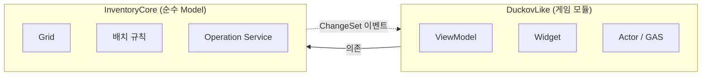

# Duckov_Like

**싱글플레이 탑다운 익스트랙션 슈터 — 그리드 인벤토리 시스템 포트폴리오**

`UE 5.7` · `C++` · `UMG MVVM` · `GAS` · `Windows`

---

## 이 프로젝트가 증명하려는 것

상용 게임의 완성이 아니라 **시스템 하나를 제대로 설계하고, 설계대로 동작함을 검증 가능한
형태로 만들 수 있는가**를 보인다.

> 아이템 배치 규칙을 Model에 집중하고, UMG MVVM으로 표현한 그리드 인벤토리를
> 실제 루팅–탈출 루프에 연결한다.

기술 증명 축은 **①그리드 인벤토리 ②MVVM ③GAS** 순이며, 리소스가 부족하면 ③부터 줄인다.
레퍼런스는 *Escape From Duckov*(Team Soda)이며 **분석 대상이지 클론 대상이 아니다.**

---

## 핵심 설계: 모듈 경계를 빌드 시스템으로 강제한다

`View → ViewModel → Model` 단방향 의존은 흔한 원칙이다. 문제는 **단일 모듈에서는 지켰는지
확인할 방법이 없다**는 것이다. Model 코드가 위젯을 직접 조작해도 빌드는 통과한다.

그래서 게임 코드를 두 모듈로 나누고 의존을 `Build.cs`에 고정했다.



| 모듈 | 책임 | 의존 |
| --- | --- | --- |
| **`InventoryCore`** | 그리드, 배치 규칙, 연산 서비스, 저장 레코드 | `Core`, `CoreUObject`, `Engine` |
| **`DuckovLike`** | ViewModel, 위젯, 액터, GAS | 위 + `InputCore`, `EnhancedInput`, `InventoryCore`, `UMG`, `ModelViewViewModel` |

두 `Build.cs`를 나란히 놓으면 경계가 읽힌다 — 한쪽에는 UI 모듈이 있고, 한쪽에는 없다.

### 경계가 실제로 작동하는 지점 (실측)

`InventoryCore`에서 UMG를 쓰려고 시도해 3단계로 측정했다.

| 시도 | 결과 |
| --- | --- |
| `#include "Blueprint/UserWidget.h"` | 통과 |
| `UUserWidget* Ptr = nullptr;` | 통과 |
| `UUserWidget::StaticClass()` | **`LNK2019` → 빌드 실패** |

```
error LNK2019: unresolved external symbol Z_Construct_UClass_UUserWidget_NoRegister
fatal error LNK1120: 1 unresolved externals
Result: Failed
```

헤더가 통과하는 이유는 에디터 타깃의 `SharedPCH.UnrealEd`가 UMG 헤더를 이미 담고 있기
때문이다. 경계를 만드는 것은 include path가 아니라 **`UMG.lib`가 링크 라인에 없다는 사실**이다.

즉 경계는 즉각적이지 않지만 **우회 불가능하다.** UI 타입의 이름을 적어 둘 수는 있어도,
그것을 실제로 사용하는 코드는 한 줄도 빌드를 통과하지 못한다.

→ 결정 근거와 기각한 대안: [ADR-000](docs/architecture/ADR-000-module-boundaries.md)

---

## 설계 원칙

| 원칙 | 내용 |
| --- | --- |
| **Single source of truth** | 위치·회전·수량은 Model만 소유한다. View/ViewModel은 원본 상태를 갖지 않는다 |
| **원자성** | 컨테이너 간 이동은 전체 검증 뒤 한 번에 커밋한다. 실패 시 양쪽 상태가 변하지 않는다 |
| **명시적 실패** | `bool`이 아니라 실패 사유를 반환한다 — `NoSpace`, `Occupied`, `InvalidCategory`, `StackFull` … |
| **안정적 식별자** | 아이템 Instance는 `FGuid`로 저장과 ViewModel 매핑을 지원한다 |
| **이벤트 기반 UI** | 인벤토리 화면은 상시 Tick에 의존하지 않는다 |

불변식 8개(`INV-01`~`INV-08`)와 연산 계약은 [인벤토리 설계 문서](docs/INVENTORY_DESIGN.md)에 있다.

---

## 진행 상황

| 단계 | 내용 | 상태 |
| --- | --- | --- |
| M0 | 설계 — 데이터 소유권, 불변식, 연산 계약, MVVM 흐름 | 문서 완료 · ADR 미승인 |
| M0.5 | UE 프로젝트 스캐폴딩, 모듈 분리 | ✅ **완료** |
| **M1** | **Model 구현 — 배치·이동·스택·정렬·저장** | 🔜 다음 |
| M2 | ViewModel + UMG | |
| M3 | 게임 루프 — 루팅·장비·탈출·스태시, GAS | |
| M4 | 성능 점검, 문서·영상 정리 | |

**v1 완료 기준**: Model Automation Test 30개 이상 통과 ·
20x20 스태시 + 아이템 100개에서 상시 Tick 위젯 0

> 현재는 **스캐폴딩까지 완료된 상태**다. 인벤토리 로직은 아직 구현되지 않았다.

---

## 문서

| 문서 | 내용 |
| --- | --- |
| [GDD](docs/GDD.md) | 목표·성공 기준·범위(P0/P1/P2)·기술 방침·검증 계획 |
| [인벤토리 설계](docs/INVENTORY_DESIGN.md) | 불변식, 제안 아키텍처(A1~E3), 연산 계약, MVVM 데이터 흐름 |
| [컨벤션](docs/CONVENTIONS.md) | 모듈 경계, 네이밍, Content 폴더 규약 |
| [ADR](docs/architecture/) | 구조 결정 기록 — 결정·근거·기각한 대안·검증 |
| [작업 기록](docs/worklog/) | 마일스톤별 작업 내역, AI 활용 내역, 막혔던 것 |

문서의 아키텍처 항목(`A1`~`E3`)과 `ADR-001`~`008`은 **전부 `Proposed`다.**
구현 전 `Accepted`로 전환한다.

---

## 빌드

**요구사항**: UE 5.7 · Visual Studio 2022 (C++ 데스크톱 개발) · Git LFS

```bash
git clone https://github.com/Jangjinhyeok/Duckov_Like.git
cd Duckov_Like
git lfs install
```

```bash
"C:\Program Files\Epic Games\UE_5.7\Engine\Build\BatchFiles\Build.bat" \
  DuckovLikeEditor Win64 Development \
  -Project="<repo>\DuckovLike.uproject" -WaitMutex -NoHotReload
```

성공하면 `Binaries/Win64/`에 두 개의 DLL이 생성된다 —
`UnrealEditor-InventoryCore.dll`, `UnrealEditor-DuckovLike.dll`.

---

## 의도적으로 제외한 범위

네트워크 / Replication · 베이스 건설 · 펫/동료 · 스킬 트리 · 다수의 맵·적·무기

> 범위 판단 기준: **인벤토리의 구조적 완성도나 검증 가능성을 높이지 않으면 v1에서 뺀다.**

---

## 레퍼런스 표기

이 저장소의 문서에 인용된 레퍼런스 이미지는 **Escape From Duckov**(개발: Team Soda)의
인게임 화면이며, 설계 분석 목적으로만 사용했다. 저작권은 개발사에 있으며 본 프로젝트의
구현물이 아니다.
