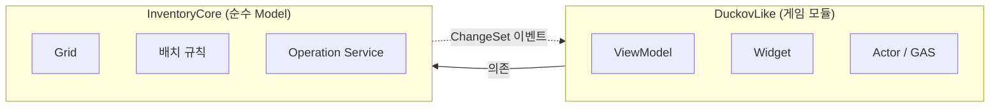

# Duckov_Like

**싱글플레이 탑다운 익스트랙션 슈터 — CommonUI·UMG와 그리드 인벤토리 포트폴리오**

`UE 5.7` · `C++` · `UMG MVVM` · `GAS` · `Windows`

> ### 🤖 이 프로젝트는 AI를 활용한 프로젝트입니다.
>
> **AI를 활용해 개발합니다.** 사용자는 목표·범위와 결과 수용을 맡고,
> AI는 기능 단위로 설계·구현·검증을 수행합니다.
> AI가 내린 기술 판단과 사용자가 실제 검토·수정한 내용을 구분해 기록합니다.
>
> → [**AI 활용 방식**](#ai-활용-방식) · [작업 분담 규약](CLAUDE.md) · [작업 기록](docs/worklog/)

---

## 이 프로젝트가 증명하려는 것

상용 게임의 완성이 아니라 **시스템 하나를 제대로 설계하고, 설계대로 동작함을 검증 가능한
형태로 만들 수 있는가**를 보인다.

> 아이템 배치 규칙을 Model에 집중하고, UMG MVVM으로 표현한 그리드 인벤토리를
> 실제 루팅–탈출 루프에 연결한다.

기술 증명 축은 **①CommonUI·UMG 사용자 경험 ②MVVM과 검증 가능한 인벤토리 Model ③GAS** 순이다.
CommonUI는 앞으로 구현할 목표이며 현재 프로젝트에는 활성화되어 있지 않다. 리소스가 부족하면 ③부터 줄인다.
레퍼런스는 *Escape From Duckov*(Team Soda)이며 **분석 대상이지 클론 대상이 아니다.**

---

## AI 활용 방식

2026-09-10부터 **기능 단위 자율 실행과 결과 검토**를 기본으로 한다.

| 사람이 하는 것 | AI가 하는 것 |
| --- | --- |
| 목표·범위·완료 기준 제시 | 권장 설계와 핵심 trade-off 설명 |
| 계약을 깨는 변경·범위 확대 판단 | 범위 안의 header·specifier·구현·테스트 작성 |
| 동작과 핵심 구조 검토, 결과 수용 | 빌드·검증, 책임과 데이터 흐름 설명 |
| 필요할 때 학습·수정 요청 | 필요한 ADR와 worklog를 기능 단위로 정리 |

문서마다 사용자 선답변을 받거나 테스트 이름을 직접 쓰게 하지 않는다.
AI가 핵심 선택·근거·대안과 검증 결과를 함께 제출해 사용자가 결과를 판단할 수 있게 한다.
기존 계약을 깨는 변경은 먼저 확인하며, commit·push는 별도 명시 권한이 필요하다.

설명 역전·퀴즈·Option Sweep·walkthrough는 학습을 요청할 때만 사용한다. 구현·검증 완료와 사용자 이해·검토 상태는
분리해 기록한다. 과거 ADR와 worklog는 당시 방식의 기록으로 보존하되, 옛 학습·승인 절차보다
현재 작업 분담 규칙이 우선한다. 일반 작업에는 HANDOFF/RESULT를 의무 생성하지 않으며 명시적 Two-CLI dispatch의 protocol은 유지한다.

### 기록

주장으로 끝내지 않기 위해 분담 내역을 저장소에 남긴다.

- [**작업 분담 규약**](CLAUDE.md) — 세션마다 자동 적용되는 규칙 (5절)
- [**작업 기록**](docs/worklog/) — 기능 완료 시 해당 마일스톤에 변경·검증·판단 출처를 한 번 요약.
  과거의 **내가 결정한 것 / AI가 수행한 것 / 내가 반려·수정한 것** 기록도 보존
- [**설계결정기록**](docs/architecture/) — 결정·근거·기각한 대안

> **예시** — `설계결정기록 000` 초안에서 AI는 모듈 경계 위반이 *"컴파일 에러로 막힌다"*고 썼다.
> 실측해 보니 컴파일과 타입 선언은 통과하고 **링크에서 `LNK2019`로 깨졌다.**
> 문서를 측정값으로 교정했고, 그 경위를 작업 기록에 남겼다.
> AI 출력을 검증 없이 받지 않는다는 것을 보이는 자리다.

---

## 핵심 설계: 모듈 경계를 빌드 시스템으로 강제한다

`View → ViewModel → Model` 단방향 의존은 흔한 원칙이다. 문제는 **단일 모듈에서는 지켰는지
확인할 방법이 없다**는 것이다. Model 코드가 위젯을 직접 조작해도 빌드는 통과한다.

그래서 게임 코드를 두 모듈로 나누고 의존을 `Build.cs`에 고정했다.

아래 그림과 책임 표는 목표 구조를 포함한다. 현재는 Model과 모듈 의존이 구현돼 있고,
ViewModel·Widget·ChangeSet 이벤트·저장 레코드·GAS 게임 로직은 아직 구현되지 않았다.
검증용 `InventoryCoreTests`는 두 Runtime 모듈과 별도의 Editor 모듈이다.



| 모듈 | 책임 | 의존 |
| --- | --- | --- |
| **`InventoryCore`** | 그리드, 배치 규칙, 연산 서비스, 저장 레코드 | `Core`, `CoreUObject`, `Engine` |
| **`DuckovLike`** | ViewModel, 위젯, 액터, GAS | 위 + `InputCore`, `EnhancedInput`, `InventoryCore`, `UMG`, `ModelViewViewModel` |

두 `Build.cs`를 나란히 놓으면 경계가 읽힌다 — 한쪽에는 UI 모듈이 있고, 한쪽에는 없다.

### 경계가 실제로 작동하는 지점 (실측)

M0.5에서 `InventoryCore`의 UMG 사용을 3단계로 측정한 기록이다.
이번 문서 변경에서는 재실행하지 않았다([당시 작업 기록](docs/worklog/M0.5-scaffolding.md)).

| 시도 | 결과 |
| --- | --- |
| `#include "Blueprint/UserWidget.h"` | 통과 |
| `UUserWidget* Ptr = nullptr;` | 통과 |
| `UUserWidget::StaticClass()` | **`LNK2019` → 빌드 실패** |

```
error LNK2019: unresolved external symbol Z_Construct_UClass_UUserWidget_NoRegister
fatal error LNK1120: 1 unresolved externals
Result: Failed
```

헤더가 통과하는 이유는 에디터 타깃의 `SharedPCH.UnrealEd`가 UMG 헤더를 이미 담고 있기
때문이다. 경계를 만드는 것은 include path가 아니라 **`UMG.lib`가 링크 라인에 없다는 사실**이다.

즉 경계는 즉각적이지 않지만 **우회 불가능하다.** UI 타입의 이름을 적어 둘 수는 있어도,
그것을 실제로 사용하는 코드는 한 줄도 빌드를 통과하지 못한다.

→ 결정 근거와 기각한 대안: [설계결정기록 000](docs/architecture/000-module-boundaries.md)

---

## 설계 원칙

| 원칙 | 내용 |
| --- | --- |
| **Single source of truth** | 위치·회전·수량은 Model만 소유한다. View/ViewModel은 원본 상태를 갖지 않는다 |
| **원자성** | 컨테이너 간 이동은 전체 검증 뒤 한 번에 커밋한다. 실패 시 양쪽 상태가 변하지 않는다 |
| **명시적 실패** | `bool`이 아니라 실패 사유를 반환한다 — `NoSpace`, `Occupied`, `InvalidCategory`, `StackFull` … |
| **안정적 식별자** | 아이템 Instance는 전역 순차 카운터가 발급하는 `int32` 번호로 저장과 ViewModel 매핑을 지원한다 |
| **이벤트 기반 UI** | 인벤토리 화면은 상시 Tick에 의존하지 않는다 |

불변식 8개(`INV-01`~`INV-08`)와 연산 계약은 [인벤토리 설계 문서](docs/INVENTORY_DESIGN.md)에 있다.

---

## 진행 상황

| 단계 | 내용 | 상태 |
| --- | --- | --- |
| M0 | 설계 — 데이터 소유권, 불변식, 연산 계약, MVVM 흐름 | 초기 문서 작성됨 · ADR별 상태 확인 |
| M0.5 | UE 프로젝트 스캐폴딩, 모듈 분리 | ✅ **완료** |
| **M1a** | **Model 핵심 — 배치·이동·스택** | 코드 구현됨 · worklog에 24개 통과 기록 · 사용자 검토 별도 |
| M1b | Model 파생 — 정렬·저장·리사이즈 | |
| M2 | ViewModel + CommonUI·UMG | |
| M3 | 게임 루프 — 루팅·장비·탈출·스태시, GAS | |
| M4 | 성능 점검, 문서·영상 정리 | |

**v1 완료 기준**: Model Automation Test 30개 이상 통과 ·
20x20 스태시 + 아이템 100개에서 상시 Tick 위젯 0

> 현재 Model의 배치·이동·스택과 테스트 모듈이 구현돼 있다. [M1a 작업 기록](docs/worklog/M1a.md)에
> Automation Test 24개 통과가 기록돼 있으며, 이 문서 갱신에서 재실행한 결과는 아니다.
> UI는 아직 구현되지 않았다. 과거 worklog의 설명 역전 대기는 현재 기술적 완료 gate가 아니다.
> `.uproject`에는 ModelViewViewModel·GameplayAbilities 플러그인이 활성화되어 있지만,
> CommonUI는 등록되어 있지 않고 `Build.cs` 의존에도 없다. 플러그인 활성화와 기능 구현은 구분한다.

---

## 문서

| 문서 | 내용 |
| --- | --- |
| [GDD](docs/GDD.md) | 목표·성공 기준·범위(P0/P1/P2)·기술 방침·검증 계획 |
| [인벤토리 설계](docs/INVENTORY_DESIGN.md) | 불변식, 제안 아키텍처(A1~E3), 연산 계약, MVVM 데이터 흐름 |
| [컨벤션](docs/CONVENTIONS.md) | 모듈 경계, 네이밍, Content 폴더 규약 |
| [설계결정기록](docs/architecture/) | 구조 결정 기록 — 결정·근거·기각한 대안·검증 |
| [작업 기록](docs/worklog/) | 마일스톤별 작업 내역, AI 활용 내역, 막혔던 것 |

초기 설계 문서의 제안과 이후 Accepted ADR를 구분한다. 상태는 각 ADR에서 확인하며,
새 결정에는 [현재 작업 분담 규약](CLAUDE.md)의 권한과 기록 방식을 적용한다.
과거 ADR를 일괄 재승인하거나 사용자 판단의 출처를 소급 변경하지 않는다.

---

## 빌드

**요구사항**: UE 5.7 · Visual Studio 2022 (C++ 데스크톱 개발) · Git LFS

```bash
git clone https://github.com/Jangjinhyeok/Duckov_Like.git
cd Duckov_Like
git lfs install
```

프로젝트 루트에서 PowerShell로 실행한다.

```powershell
& "C:\Program Files\Epic Games\UE_5.7\Engine\Build\BatchFiles\Build.bat" DuckovLikeEditor Win64 Development "-Project=$PWD\DuckovLike.uproject" -WaitMutex -NoHotReload
```

출력의 `Result: Succeeded`로 성공을 확인한다. 현재 Editor target의 프로젝트 모듈 DLL은
`Binaries/Win64/`의 `UnrealEditor-InventoryCore.dll`, `UnrealEditor-DuckovLike.dll`,
`UnrealEditor-InventoryCoreTests.dll`이다.

---

## 의도적으로 제외한 범위

네트워크 / Replication · 베이스 건설 · 펫/동료 · 스킬 트리 · 다수의 맵·적·무기

> 범위 판단 기준: **UI 경험·구조·검증을 보여주는 데 필요한 기능을 우선한다.**

---

## 레퍼런스 표기

이 저장소의 문서에 인용된 레퍼런스 이미지는 **Escape From Duckov**(개발: Team Soda)의
인게임 화면이며, 설계 분석 목적으로만 사용했다. 저작권은 개발사에 있으며 본 프로젝트의
구현물이 아니다.
